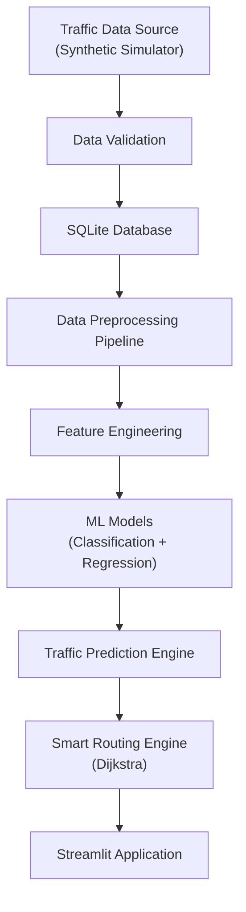

# Real-Time Traffic Prediction & Smart Routing System

An intelligent traffic management and route recommendation platform capable of simulating real-time traffic data, predicting future congestion using Machine Learning, and calculating smart routes between locations using NetworkX.

## 🌟 Features
- **Traffic Data Source:** Synthetic generator simulating 90 days of hourly traffic data for 20 Chennai locations, accounting for peak hours, weather, and accidents.
- **SQL Database:** SQLite backend storing locations, traffic data, ML predictions, and recommended routes.
- **Machine Learning:** Scikit-learn & XGBoost models for congestion classification (F1-score evaluated) and average speed regression (RMSE evaluated). Uses chronological train/test splitting.
- **Smart Routing:** NetworkX-based graph routing utilizing Dijkstra's algorithm. Edge weights factor in distance, predicted speed, congestion penalties, and incident delays.
- **Interactive Dashboard:** 9-page Streamlit application featuring KPIs, Folium maps, Plotly analytics, model evaluation metrics, and a database explorer.

## 🏗️ System Architecture



## 🛠️ Technology Stack
- **Python 3.10+**
- **Data & ML:** Pandas, NumPy, Scikit-learn, XGBoost
- **Web App:** Streamlit, Streamlit-Folium, Plotly
- **Routing:** NetworkX
- **Database:** SQLite (Parameterised Queries)

## 📁 Directory Structure
```
traffic_prediction_system/
├── app.py                      # Streamlit entry point
├── requirements.txt            # Python dependencies
├── config/                     # Configuration (DB paths, model settings)
├── database/                   # Schema, queries, and synthetic data seeder
├── models/                     # Train models, evaluate, and predict logic
├── preprocessing/              # Data cleaning and feature engineering
├── routing/                    # NetworkX graph build and routing algorithm
├── services/                   # Business logic tying DB, ML, and Routing
├── utils/                      # Constants, logger, helper functions
├── pages/                      # Streamlit multipage application files
└── tests/                      # Pytest suite
```

## 🚀 Installation & Execution

### Step 1: Environment Setup
```bash
# Create and activate virtual environment
python -m venv venv
# Windows:
venv\Scripts\activate
# Mac/Linux:
source venv/bin/activate

# Install dependencies
pip install -r requirements.txt
```

### Step 2: Configuration
Copy the environment template:
```bash
cp .env.example .env
```

### Step 3: Database Initialization & Seeding
This will create the SQLite database and populate it with 90 days of synthetic traffic data.
```bash
python -m database.seed_database
```

### Step 4: Model Training
Train the classification and regression models. The best models will be saved to `models/trained/`.
```bash
python -m models.train_model
```

### Step 5: Start the Application
Launch the interactive Streamlit dashboard.
```bash
streamlit run app.py
```

## 📊 Evaluation Metrics
- **Classification (Congestion Level):** Evaluated using Accuracy, Precision, Recall, and F1-Score.
- **Regression (Average Speed):** Evaluated using MAE, MSE, RMSE, and R².

## 🧪 Testing
Run the test suite using pytest:
```bash
pytest tests/
```

## 👨‍💻 Author
Developed as a comprehensive, end-to-end Machine Learning portfolio project.
